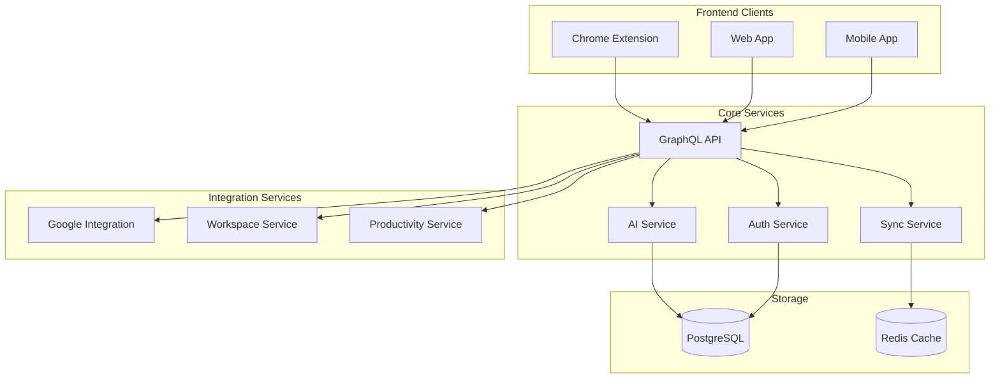

# Architecture Overview

## System Architecture



## Package Structure

```
packages/
├── api/               # GraphQL Backend
│   ├── src/
│   │   ├── schema/    # GraphQL schema
│   │   ├── resolvers/ # Query/Mutation resolvers
│   │   └── services/  # Business logic
├── core/              # Shared business logic
│   ├── src/
│   │   ├── ai/        # AI service interfaces
│   │   ├── sync/      # Data sync logic
│   │   └── workspace/ # Workspace management
├── ui/                # Shared UI components
│   ├── src/
│   │   ├── components/# Platform-agnostic components
│   │   ├── hooks/     # Custom React hooks
│   │   └── themes/    # Theming system
├── extension/         # Chrome extension
│   ├── src/
│   │   ├── background/# Extension background
│   │   ├── content/   # Content scripts
│   │   └── popup/     # Extension UI
├── web/              # Web application
└── mobile/           # Mobile app (Expo)
```

## Key Features

### 1. AI Integration
- Smart workspace organization
- Content summarization
- Task suggestions
- Context-aware assistance

### 2. Workspace Enhancement
- Unified workspace view
- Cross-platform sync
- Smart bookmarking
- Task management
- Notes and documentation

### 3. Google Integration
- Gmail integration
- Google Calendar sync
- Google Drive access
- Google Tasks sync

### 4. Productivity Features
- Smart notifications
- Focus mode
- Time tracking
- Progress analytics

### 5. Cross-Platform Support
- Chrome extension for browser integration
- Web app for desktop access
- Mobile app for on-the-go productivity
- Offline support with sync

## Technical Stack

### Frontend
- React (Web & Extension)
- React Native (Mobile)
- TailwindCSS
- Apollo Client
- Zustand (State Management)

### Backend
- Node.js
- Apollo Server
- PostgreSQL
- Redis (Caching)
- Prisma (ORM)

### AI/ML
- GPT/LLM Integration
- TensorFlow.js for client-side ML
- Vector embeddings for content analysis

### Infrastructure
- Docker containers
- GitHub Actions CI/CD
- Cloud deployment (Azure/GCP)